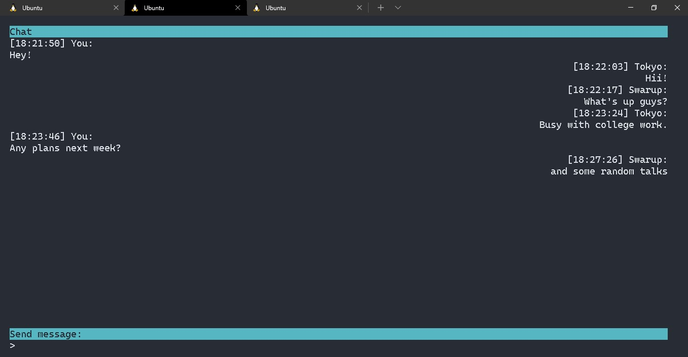

# CLI chat with GO websocket


This is a simple chat CLI written in Go


Steps to start the server

```
cd ./src
go get github.com/gorilla/websocket
go run main.go
```

Steps to start CLI

```
pip3 install -r requirements.txt
python3 clichat.py
```

Usage:
